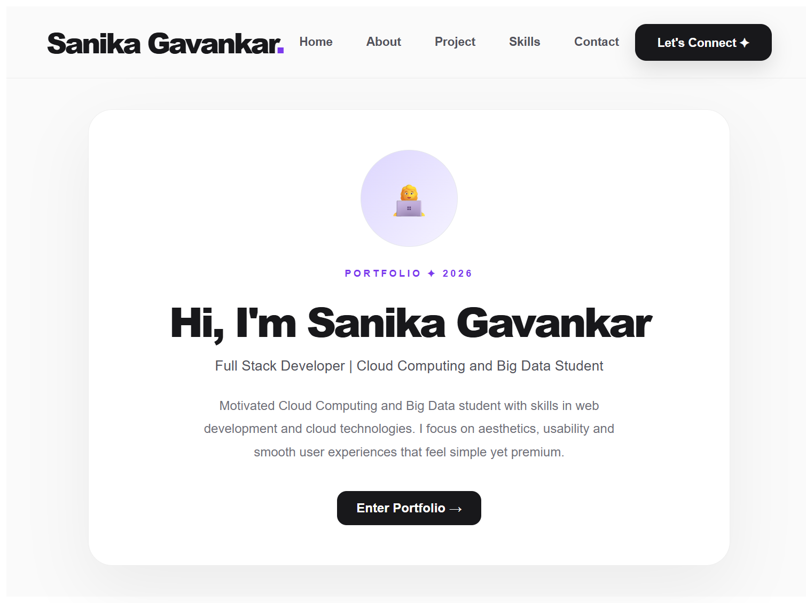
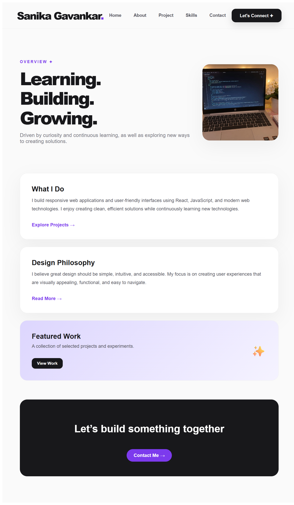
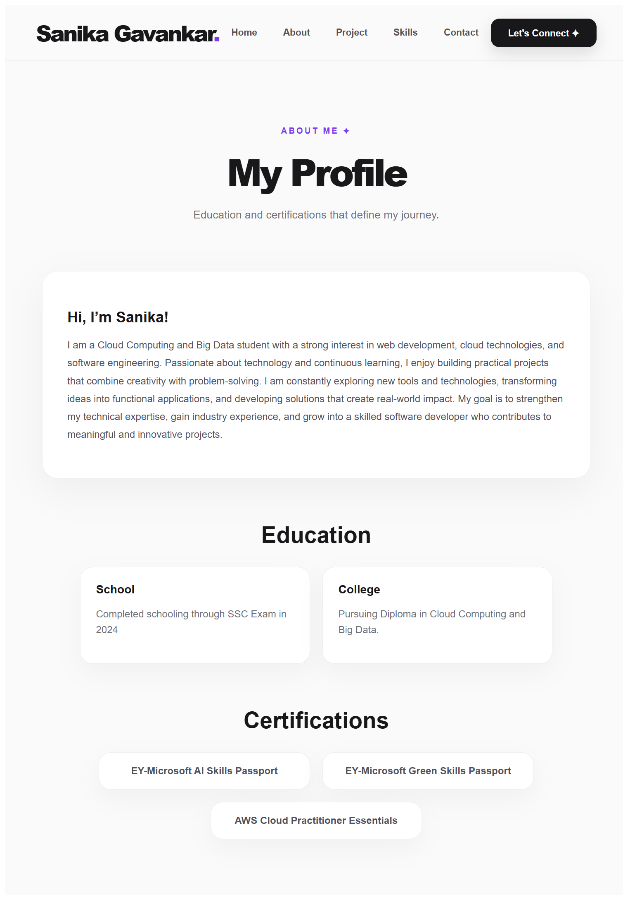
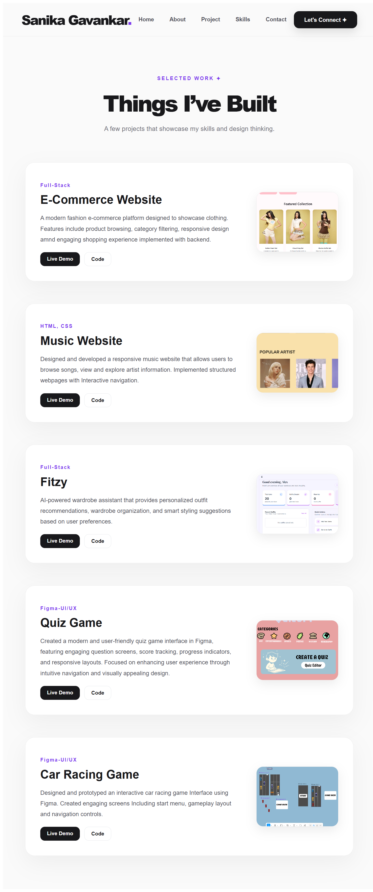
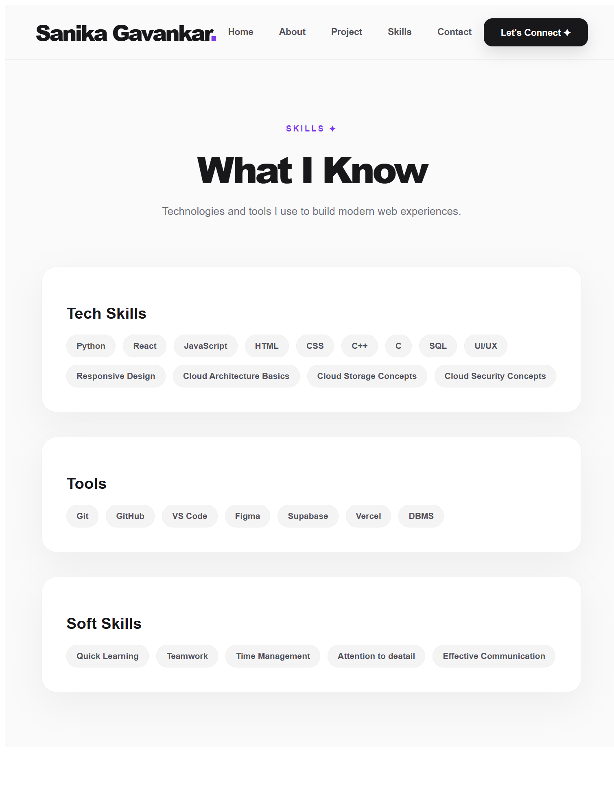
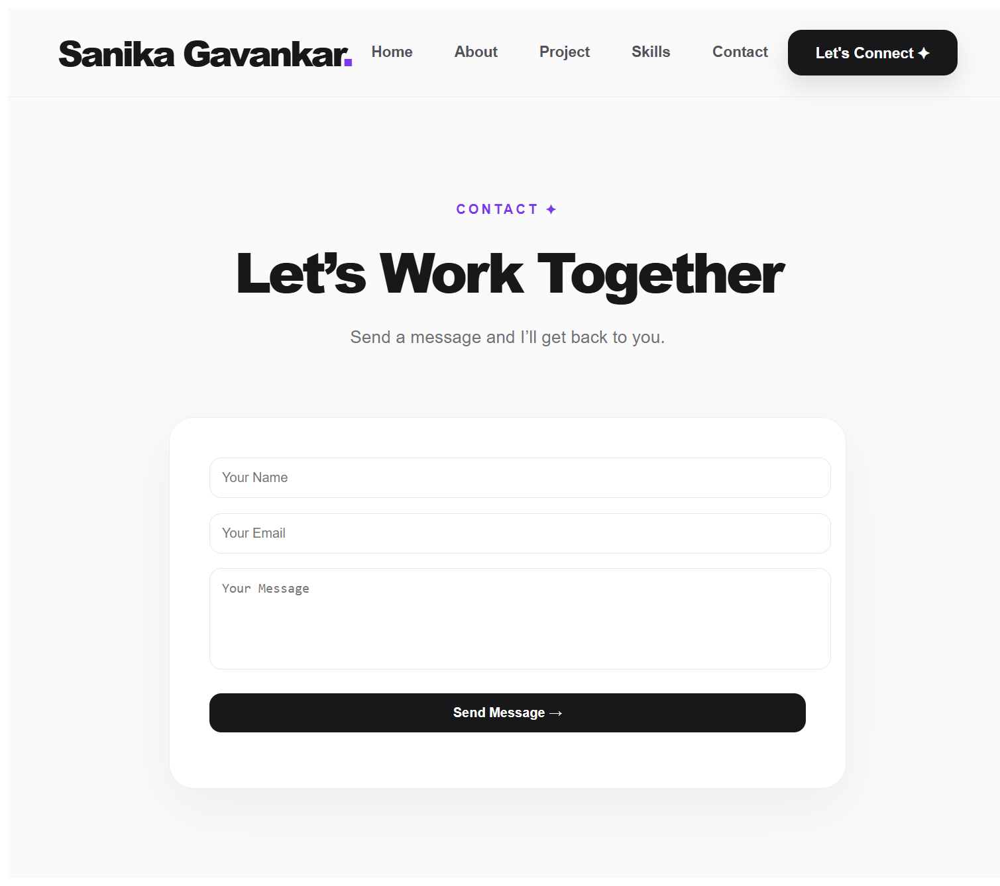

#Portfolio Website

A modern personal portfolio website built with React and React Router, featuring multiple pages like Home, About, Projects, Skills, and Contact. It includes a responsive UI, smooth navigation, and a functional contact form integrated with a Node.js/Express backend using Resend API to send real emails. The project focuses on clean design, usability, and real-world functionality.

#Features

- Hero Page
- Home Page
- Navigation Bar
- About Page
- Project Page
- Skills Page
- Contact Page

#Tech Stack

- React.js
- JavaScript
- HTML
- CSS

#Screenshots

### Hero Page

### Home Page

### About Page

### Project Page

### Skills Page

### Contact Page

